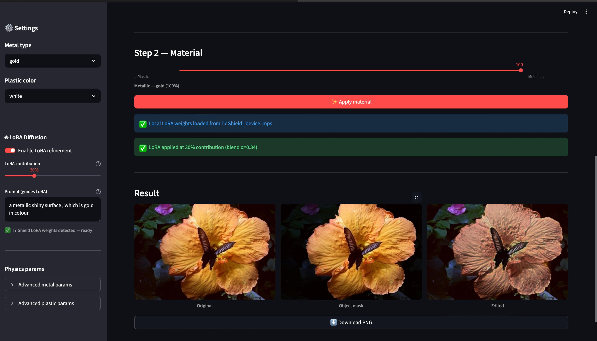
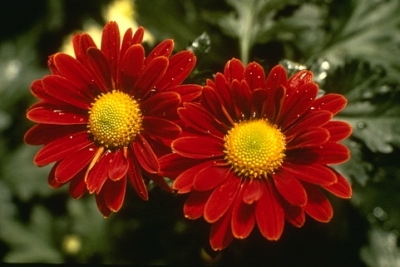
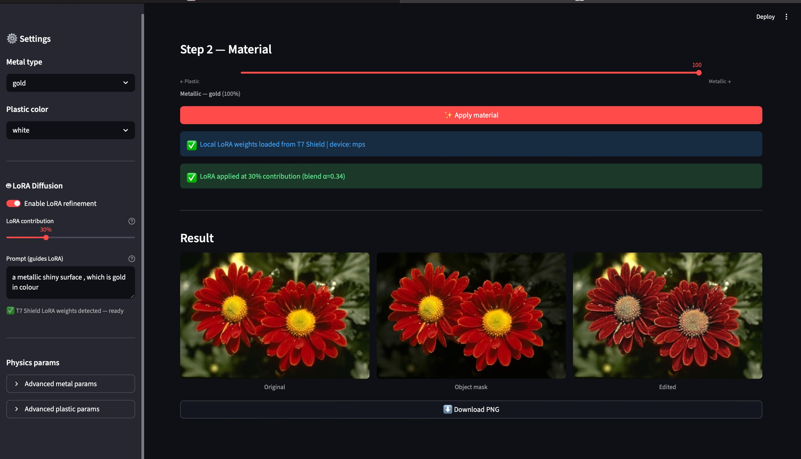
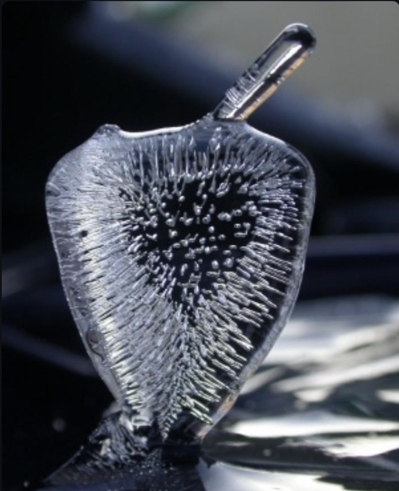
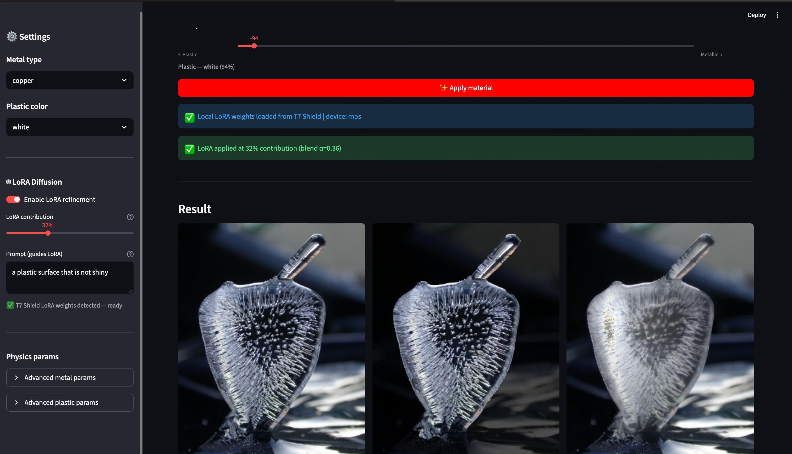

# Prompt-Guided Material Editing using Intrinsic Decomposition and LoRA Diffusion

A hybrid computer vision framework for transforming the material appearance of objects while preserving geometry, object boundaries, and scene context.

The system combines:

- Automatic object segmentation
- Intrinsic image decomposition
- Frequency-domain material manipulation
- Prompt-guided LoRA diffusion refinement
- Interactive Streamlit dashboard

Users can upload an image and continuously transform object surfaces between **plastic** and **metallic** appearances using a single material slider.

---

# Dashboard



The application automatically segments the foreground object and applies material edits only within the detected object region while preserving the background.

---

# Results

## Metallic Material Transformation

| Original Image | Metallic Output |
|----------------|-----------------|
|  |  |

The object appearance is transformed into a metallic surface by modifying reflectance, specular highlights, and high-frequency surface characteristics while preserving geometry.

---

## Plastic Material Transformation

| Original Image | Plastic Output |
|----------------|----------------|
|  |  |

The object appearance is transformed into a plastic-like material with smoother reflections, enhanced saturation, and softer highlight transitions while maintaining structural consistency.

---

# Motivation

Material editing is a challenging computer vision problem because material appearance must change without altering object geometry.

Recent diffusion models generate highly realistic images but often struggle with:

- geometry preservation
- object boundary consistency
- localized material editing
- background preservation

This project investigates whether diffusion models can be adapted for material editing and proposes a hybrid pipeline combining traditional computer vision techniques with generative refinement.

---

# Methodology

The final system follows a hybrid editing strategy.

```text
Input Image
      │
      ▼
Automatic Object Segmentation
      │
      ▼
Intrinsic Image Decomposition
(Albedo / Shading / Specularity)
      │
      ▼
Frequency Band Extraction
      │
      ▼
Material Transformation
(Metal ↔ Plastic)
      │
      ▼
Image Reconstruction
      │
      ▼
Optional LoRA Diffusion Refinement
      │
      ▼
Final Output
```

---

# Core Components

## 1. Automatic Segmentation

The uploaded image is automatically segmented to isolate the foreground object.

Material edits are applied only to the segmented object region while preserving the surrounding scene.

---

## 2. Intrinsic Image Decomposition

The image is decomposed into physically meaningful components:

- Albedo
- Shading
- Specularity

This representation enables direct manipulation of material properties while preserving geometry.

---

## 3. Frequency-Based Material Editing

Material appearance is modified by manipulating frequency-domain signals that influence:

- reflectance
- highlight sharpness
- surface roughness
- specular intensity
- metallic reflections

The editing process generates realistic metallic and plastic material characteristics without modifying object shape.

---

## 4. LoRA-Guided Diffusion Refinement

A Stable Diffusion LoRA model can optionally refine the edited output by introducing additional texture realism and visual detail.

Diffusion contributes only minor appearance refinement while the primary material transformation is performed by the intrinsic editing pipeline.

---

# LoRA Training

A custom LoRA adapter was trained using Stable Diffusion v1.5 on a synthetic material editing dataset generated from intrinsic image decomposition.

Training configuration:

| Parameter | Value |
|------------|--------|
| Base Model | Stable Diffusion v1.5 |
| LoRA Rank | 8 |
| Resolution | 512×512 |
| Batch Size | 1 |
| Gradient Accumulation | 4 |
| Learning Rate | 1e-4 |
| Training Steps | 5000 |
| Hardware | Apple Silicon (MPS) |

The dataset contained approximately:

- 300 original images
- ~30,000 metallic edits
- ~30,000 plastic edits

Total training samples:

```text
~60,000
```

---

# Important Note

The trained LoRA weights are **not included in this repository**.

The following file has been excluded:

```text
pytorch_lora_weights.safetensors
```

This repository contains only:

- Streamlit application
- inference pipeline
- material editing framework
- utility code

To enable diffusion refinement, place your trained LoRA weights inside:

```text
material_lora/
```

and update the path in the inference code if necessary.

---

# Repository Structure

```text
.
├── app.py
│
├── utils
│   └── inference.py
│
├── images
│   ├── dashboard.png
│   ├── metal_original.png
│   ├── metal_result.png
│   ├── plastic_original.png
│   └── plastic_result.png
│
├── requirements.txt
│
└── README.md
```

---

# Installation

Clone the repository:

```bash
git clone https://github.com/<your-username>/<repository-name>.git

cd <repository-name>
```

Create a virtual environment:

```bash
python -m venv venv
```

Activate:

Mac/Linux:

```bash
source venv/bin/activate
```

Windows:

```bash
venv\Scripts\activate
```

Install dependencies:

```bash
pip install -r requirements.txt
```

---

# Running the Application

Launch the Streamlit dashboard:

```bash
streamlit run app.py
```

Open:

```text
http://localhost:8501
```

in your browser.

---

# Experimental Observations

During experimentation with LoRA-enhanced Stable Diffusion, the following limitations were observed:

### Low img2img strength

- geometry preserved
- minimal material transformation

### High img2img strength

- stronger material appearance
- object boundary distortion
- geometric changes
- background artifacts

These observations suggest that diffusion models alone struggle to balance structure preservation and material transformation.

The final hybrid approach achieved significantly better control by performing material editing directly on intrinsic image components and using diffusion only for lightweight refinement.

---

# Future Work

Potential future extensions include:

- larger real-world material datasets
- neural intrinsic decomposition networks
- SAM2-based segmentation
- additional material categories (glass, wood, fabric)
- quantitative material realism evaluation
- multi-view material editing
- real-time GPU acceleration

---

# References

1. Ho et al. — Denoising Diffusion Probabilistic Models

2. Rombach et al. — High-Resolution Image Synthesis with Latent Diffusion Models

3. Hu et al. — LoRA: Low-Rank Adaptation of Large Language Models

4. Kirillov et al. — Segment Anything

5. Bell et al. — Intrinsic Images in the Wild

---

# Author

**Ayush Tiwari**

Computer Vision • Image Editing • Generative AI

Shiv Nadar University
